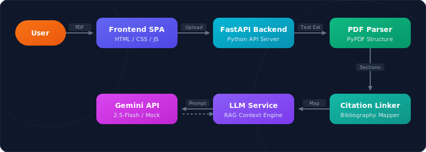

# review_n_summary

An automated academic paper ingestion, critique, and summarisation tool designed for researchers and students. It combines custom heuristic PDF parsing, citation bibliography linking, structured multi-aspect LLM analysis (powered by Gemini API), and an interactive context-grounded chat room.

## Technical Architecture



### 1. Document Structuring & Parser
* **Section Segmentation:** Scans PDF text page-by-page using `pypdf`, mapping section headers (such as Abstract, Introduction, Methodology, Experiments, Results, Conclusions, and References) to their respective start and end pages.
* **Bibliography Extraction:** Dynamically parses the `References` section, extracting individual publication entries (supporting both IEEE bracketed lists and APA-style alphabetized indexes).
* **In-Text Citation Mapping:** Maps every reference to its exact occurrences in the body text. Compiled citation instances display context sentences, page numbers, and parent sections to trace where and why work was cited.

### 2. PhD-Level LLM Critique
* **Structured Synthesis:** Generates a 6-aspect academic evaluation utilizing the Gemini API:
  * **Executive Synopsis:** High-level problem statement, target application, and final outcomes.
  * **Key Contributions:** List of novel designs, proofs, algorithms, or experimental discoveries.
  * **Methodology & Framework:** Synthesis of datasets, training regimes, mathematical models, or hardware setups.
  * **Critical Review:** Rigorous review detailing baseline weaknesses, limitations, missing evaluations, or unproved assumptions.
  * **Future Scope:** Recommended concrete directions for follow-up studies.
  * **Keyword Tagging:** Conceptual scientific keywords with relevance scores.
* **Mock Mode Fallback:** Automatically switches to an adaptive, domain-aware mock generator if a Gemini API Key is missing, enabling local evaluation out of the box.

### 3. Contextual Research Q&A
* Implements a local keyword-overlap Retrieval-Augmented Generation (RAG) system. User questions are matched against the paper's section contents to retrieve relevant context.
* The assistant replies with evidence grounded in the text, citing page numbers and section names (e.g. `[Methodology Section]`, `[Page 4]`).

---

## Technical Stack
* **Backend:** Python 3.14, FastAPI, Uvicorn, PyPDF, Google GenAI SDK (`google-genai`), Python-Dotenv.
* **Frontend:** HTML5 (Semantic Structure), Vanilla CSS (Responsive Flexbox Grid, Glassmorphic Styling, and Animations), Vanilla JavaScript (Drag-Drop Ingestion, XMLHttp progress tracking, state management, and markdown formatting).

---

## Getting Started

### 1. Installation
We have provided a helper bash script `setup.sh` that detects missing dependencies, requests permission to install APT packages (like `python3-pip` and `python3-venv`), creates a localized Python virtual environment, and installs requirements safely.

Run the setup script in your terminal:
```bash
chmod +x setup.sh
./setup.sh
```

During setup, you will be prompted to enter your `GEMINI_API_KEY`. If left empty, the application will launch in **Demo Mock Mode** so you can test the interface immediately.

### 2. Starting the Application
If you choose not to start the server automatically during setup, you can launch it manually:
```bash
# Activate the virtual environment
source venv/bin/activate

# Launch the FastAPI web server
uvicorn app.main:app --reload --host 0.0.0.0
```

Open your browser and navigate to:
[http://localhost:8000](http://localhost:8000) or your network IP address.

---

## Codebase Structure
* `setup.sh` - Interactive script to manage dependencies, pip virtualenv, and config.
* `requirements.txt` - Project dependencies list.
* `app/main.py` - FastAPI application entrypoint, routes, uploads management, and report export.
* `app/parser.py` - Academic paper text segmentation and citation-to-references mapping.
* `app/llm.py` - Gemini API SDK connector, structured response generation, and RAG search.
* `app/static/` - Single Page Application files.
  * `index.html` - Dashboard layout with sub-section panes and SVGs.
  * `styles.css` - Theme styles, glassmorphic card variables, and smooth animations.
  * `app.js` - Dynamic DOM controller, file uploader, and state machine.
